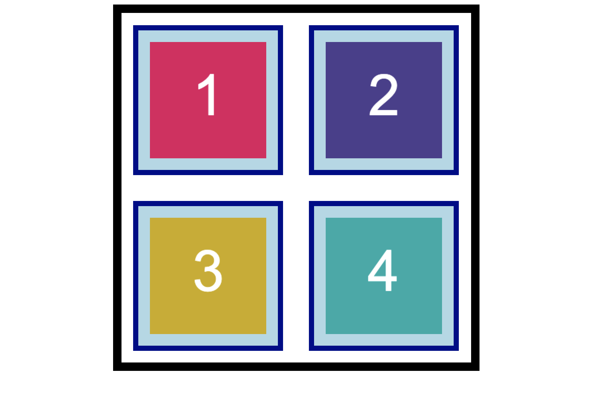

# Implement CSS Box Model Properties to Design Layout

Edit the starter code to match the user story below.

* As a developer, I want to use the CSS box model properties to position four boxes inside a frame.

## Acceptance Criteria

* It's done when each box has a defined `padding` property.

* It's done when each box has a defined `margin` property.

* It's done when each box has a defined `border` property.

* It's done when the finished page matches the mockup.

## 📝 Notes

Refer to the documentation: 

[MDN Web Docs on CSS basic box model](https://developer.mozilla.org/en-US/docs/Web/CSS/CSS_Box_Model)

[MDN Web Docs on padding](https://developer.mozilla.org/en-US/docs/Web/CSS/padding)

[MDN Web Docs on margin](https://developer.mozilla.org/en-US/docs/Web/CSS/margin)

[MDN Web Docs on border](https://developer.mozilla.org/en-US/docs/Web/CSS/border)

## Assets

The following image demonstrates the web application's appearance and functionality:

---

## 💡 Hints

How can we use the `margin` property to define space between elements?

## 🏆 Bonus

If you have completed this activity, these are some questions you could ask yourself:

* What is the CSS `float` property?

Use [Google](https://www.google.com) or another search engine to research this.
